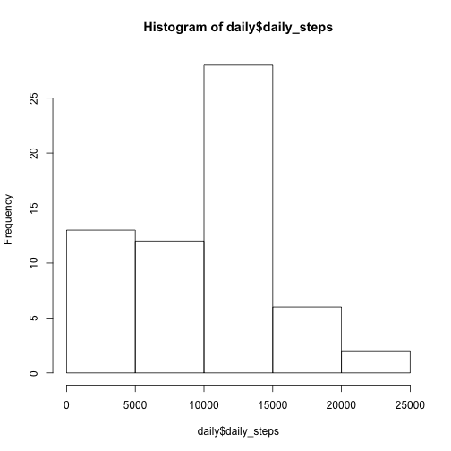
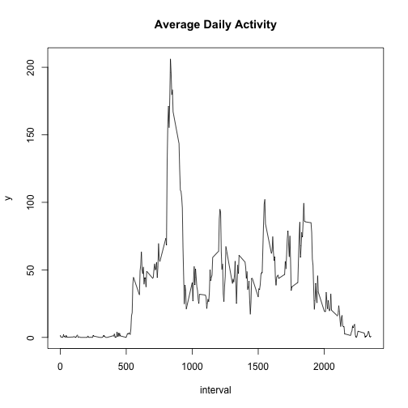
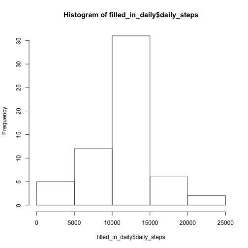
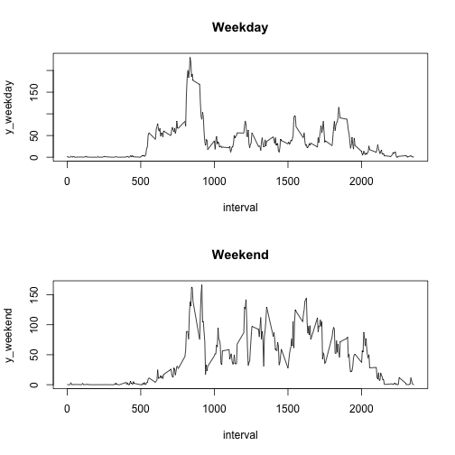

# Loading and preprocessing the data.  


###**1. Load the data.**

```r
library(data.table)
activity <- read.csv('activity.csv')
```

```
## Warning in file(file, "rt"): cannot open file 'activity.csv': No such file
## or directory
```

```
## Error in file(file, "rt"): cannot open the connection
```


###**2. Process the data.**

```r
activity$date <- as.Date(as.character(activity$date))
head(activity)
```

```
##   steps       date interval
## 1    NA 2012-10-01        0
## 2    NA 2012-10-01        5
## 3    NA 2012-10-01       10
## 4    NA 2012-10-01       15
## 5    NA 2012-10-01       20
## 6    NA 2012-10-01       25
```


# What is the mean total number of steps taken per day?

```r
daily_activity <- split(activity, activity$date)
days <- length(daily_activity)
daily_steps <- NULL
daily_mean <- NULL
daily_median <- NULL
for (i in 1:days){
        daily_steps <- c(daily_steps, sum(daily_activity[[i]]$steps,na.rm = TRUE))
}

daily <- data.frame('date'= unique(activity$date),
                    'daily_steps'=  daily_steps)
head(daily)
```

```
##         date daily_steps
## 1 2012-10-01           0
## 2 2012-10-02         126
## 3 2012-10-03       11352
## 4 2012-10-04       12116
## 5 2012-10-05       13294
## 6 2012-10-06       15420
```


###**1. Histogram of the total number steps per day.**


```r
hist(daily$daily_steps)
```

 


###**2. Mean and median of the total number of steps taken each day.**


```r
mean_total_steps <- mean(daily$daily_steps)
median_total_steps <- median(daily$daily_steps)
```

**Mean** is 9354.2295082 and **median** is 10395.

# What is the average daily activity pattern?

###**1. Panel plot representing (y-axis) the average number of steps taken, averaged across all days, in function of the 5-minute interval (x-axis).**


```r
x <- daily_activity[[1]]$interval

y <- NULL
number_of_intervals <- nrow(daily_activity[[1]])
interval_activity <- split(activity, activity$interval)
for (i in 1:number_of_intervals){
        y <- c(y, mean(interval_activity[[i]]$steps, na.rm = TRUE))
}
plot(x,y, type='l', xlab = 'interval')
title('Average Daily Activity')
```

 

```r
interval_max <- x[which.max(y)]
```

The **5-minute interval, on average across all the days in the dataset, that contains the maximum number of steps** is 835.


# Imputing missing values.

###**1. Total number of missing values in the dataset.**


```r
length(activity$steps[is.na(activity$steps)])
```

```
## [1] 2304
```


###**2. Filling in missing values.** 

We decide to replace each missing value in a certain interval with the **mean of the values in this interval**.


```r
filling_values <- y

filled_in_interval_activity <- interval_activity
for (i in 1:number_of_intervals){
        index <- which(is.na(interval_activity[[i]]$steps))
        filled_in_interval_activity[[i]]$steps[index] <- rep(filling_values[i], length(index))
}
```

###**3. Here is the filled in dataset.**


```r
filled_in_activity <- rbindlist(filled_in_interval_activity)
index <- with(filled_in_activity, order(date, interval))
filled_in_activity <- as.data.frame(filled_in_activity[index, ])
head(filled_in_activity)
```

```
##       steps       date interval
## 1 1.7169811 2012-10-01        0
## 2 0.3396226 2012-10-01        5
## 3 0.1320755 2012-10-01       10
## 4 0.1509434 2012-10-01       15
## 5 0.0754717 2012-10-01       20
## 6 2.0943396 2012-10-01       25
```


###**4. Histogram, mean and median of the total of the total number of steps per day for the filled in dataset.**


```r
filled_in_daily_activity <- split(filled_in_activity, filled_in_activity$date)
daily_steps <- NULL
daily_mean <- NULL
daily_median <- NULL
for (i in 1:days){
        daily_steps <- c(daily_steps, 
                                   sum(filled_in_daily_activity[[i]]$steps))
}

filled_in_daily <- data.frame('date'= unique(activity$date),
                              'daily_steps' = daily_steps)

hist(filled_in_daily$daily_steps)
```

 

```r
filled_in_mean_total_steps <- mean(filled_in_daily$daily_steps)
filled_in_median_total_steps <- median(filled_in_daily$daily_steps)
diff_mean <- abs(mean_total_steps-filled_in_mean_total_steps)
diff_median <- abs(median_total_steps-filled_in_median_total_steps)
```

**Mean** is 1.0766189 &times; 10<sup>4</sup> and **median** is 1.0766189 &times; 10<sup>4</sup>.

###**Observations:** 

Regarding the **mean** and **median** values:  

The **initial and second mean values** are respectively 9354.2295082 and 1.0766189 &times; 10<sup>4</sup>, and thus differ from 1411.959171, which is significant.  

On the hand, the **initial and second median values** are respectively 10395 and 1.0766189 &times; 10<sup>4</sup>, and thus don't differ much (371.1886792).    

Besides, one can see that filling in the missing values does affect 
the initial histogram. Indeed, the obtained frequency of the modified dataset is clearly better **normally** distributed (bell curve). Also, note that the **mean and median values** (1.0766189 &times; 10<sup>4</sup> and 1.0766189 &times; 10<sup>4</sup> resp.) for the modified dataset don't differ much unlike in the first place (9354.2295082 and 10395 resp.), as it is the case for **normally** distributed frequencies. 


# Are there differences in activity patterns between weekdays and weekends?


```r
new_activity <- filled_in_activity
```


###**1. Creating a new factor variable in the dataset 'new_activity'.**


```r
day_type <- function(dates){
        weekday <- c('Monday', 'Tuesday', 'Wednesday', 'Thursday', 'Friday')
        weekend <- c('Saturday', 'Sunday')
        days <- weekdays(dates)
        results <- NULL
        for (day in days){
                check <- day == weekday
                if (any(check)){
                        results <- c(results,'weekday')
                }else{
                        results <- c(results,'weekend') 
                }
        }
        factor(results, levels = c('weekday', 'weekend'))
}

new_activity$'day_type' <- day_type(new_activity$date)
head(new_activity)
```

```
##       steps       date interval day_type
## 1 1.7169811 2012-10-01        0  weekday
## 2 0.3396226 2012-10-01        5  weekday
## 3 0.1320755 2012-10-01       10  weekday
## 4 0.1509434 2012-10-01       15  weekday
## 5 0.0754717 2012-10-01       20  weekday
## 6 2.0943396 2012-10-01       25  weekday
```


###**2. Panel plot representing (y-axis) the average number of steps taken (averaged across all weekday days or weekend days) in function of the 5-minute interval (x-axis).**


```r
x <- unique(new_activity$interval)

y_weekday <- NULL
y_weekend <- NULL
day_type_split <- split(new_activity, new_activity$day_type)
new_activity_weekday <- day_type_split$'weekday'
new_activity_weekend <- day_type_split$'weekend'
interval_new_activity_weekday <- split(new_activity_weekday, new_activity_weekday$interval)
interval_new_activity_weekend <- split(new_activity_weekend, new_activity_weekend$interval)
for (i in 1:number_of_intervals){
        y_weekday <- c(y_weekday, mean(interval_new_activity_weekday[[i]]$steps, na.rm = TRUE))
        y_weekend <- c(y_weekend, mean(interval_new_activity_weekend[[i]]$steps, na.rm = TRUE))
}

par(mfrow=c(2,1))
plot(x, y_weekday, type='l', xlab = 'interval')
title('Weekday')
plot(x, y_weekend, type='l', xlab = 'interval')
title('Weekend')
```

 
